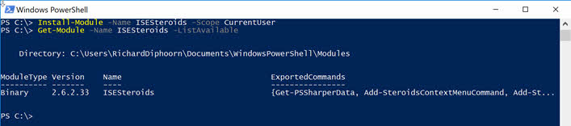

# Getting Started with ISESteroids

---

## What is ISESteroids?
ISESteroids is a PowerShell module, and it does not require Administrator privileges to get installed or used. It just takes a couple of minutes to have it up and running. And it's a clean copy/paste installation. You can completely remove ISESteroids just as easily, anytime.

---

## Download and Install
The recommended way to download and install ISESteroids is to use PowerShellGet, the official Windows PowerShell package and module management system. Use Install-Module to download and install the latest version of ISESteroids from the Microsoft PowerShell Gallery:

* You are downloading from a public repository, so there is a prompt asking you to approve the download. This will not occur when you already trusted the PowerShell Gallery in your configuration. Press "Y".
* When you use Install-Module for the first time, it asks to download nuget.exe, the open source package management engine used.
* If the cmdlet Install-Module is not available, install PowerShellGet first. You can also install Windows Management Framework 5, which includes PowerShellGet.
* If you want to install ISESteroids for all users, remove the parameter -Scope CurrentUser. You will now need Administrator privileges to install.
* If you have installed ISESteroids manually before, Install-Module emits an error, asking to add the parameter -Force. Only then can a manually installed module be overwritten.
